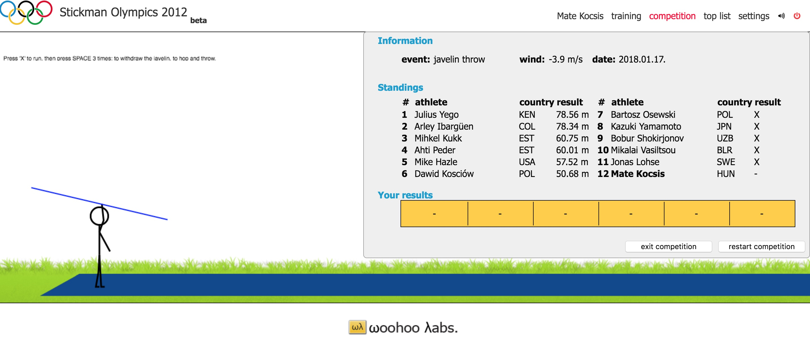

# Woohoo Labs. Olympics 2012



**Do no use the app in production, it contains serious security vulnerabilities!**

## Install

- Install Docker:
    - Mac: [https://www.docker.com/docker-mac](https://www.docker.com/docker-mac)
    - Windows: [https://www.docker.com/docker-windows](https://www.docker.com/docker-windows)
- Configure the project:
    - Copy **.env.dist** as **.env** in the project's root folder
    - Open **.env** and customize the default values

## Usage

- Launch the app:
```
$ ./go up
```

- Initialize the database:
```
$ ./go db
```

- Edit your hosts file to include the following lines (it can be usually found at `/etc/hosts`):
```
127.0.0.1       olympics.localhost
```

By default, the game is available at **https://www.olympics.localhost**. You can log in with the following credentials:

- username: `athlete`
- password: `password`

### Contributing

Please see [CONTRIBUTING](CONTRIBUTING) for details.

## License

MIT. Please see the [License File](LICENSE) for more information.
